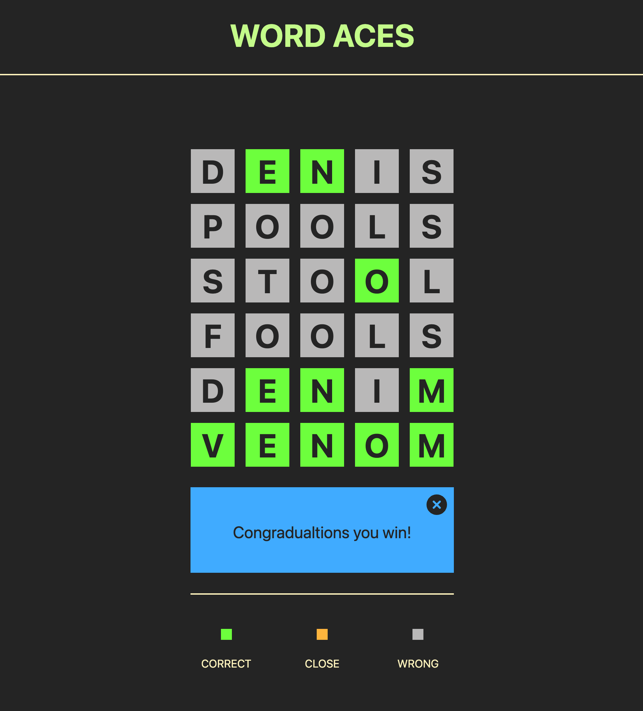

# Word Aces

## Description

Word Aces is game where you get a new five character word daily and you have to guess it.

## URL

Check the deployed web app at the following link <https://agworkgit.github.io/word-aces/>

## APIs

- Word of the day API

## Installation

Installation not required, use the deployed link listed under URL.

## Usage

The application will use the API to retrieve the word of the day and let you guess it.
A POST will be sent to the API every time you commit an answer to check if it's valid.

The following image shows the web application's appearance and functionality:

> **Note**: This layout is not optimised for mobile devices yet.

## Licence

MIT License

Copyright (c) 2023 Alex Grigore

Permission is hereby granted, free of charge, to any person obtaining a copy
of this software and associated documentation files (the "Software"), to deal
in the Software without restriction, including without limitation the rights
to use, copy, modify, merge, publish, distribute, sublicense, and/or sell
copies of the Software, and to permit persons to whom the Software is
furnished to do so, subject to the following conditions:

The above copyright notice and this permission notice shall be included in all
copies or substantial portions of the Software.

THE SOFTWARE IS PROVIDED "AS IS", WITHOUT WARRANTY OF ANY KIND, EXPRESS OR
IMPLIED, INCLUDING BUT NOT LIMITED TO THE WARRANTIES OF MERCHANTABILITY,
FITNESS FOR A PARTICULAR PURPOSE AND NONINFRINGEMENT. IN NO EVENT SHALL THE
AUTHORS OR COPYRIGHT HOLDERS BE LIABLE FOR ANY CLAIM, DAMAGES OR OTHER
LIABILITY, WHETHER IN AN ACTION OF CONTRACT, TORT OR OTHERWISE, ARISING FROM,
OUT OF OR IN CONNECTION WITH THE SOFTWARE OR THE USE OR OTHER DEALINGS IN THE
SOFTWARE.

## Badges

